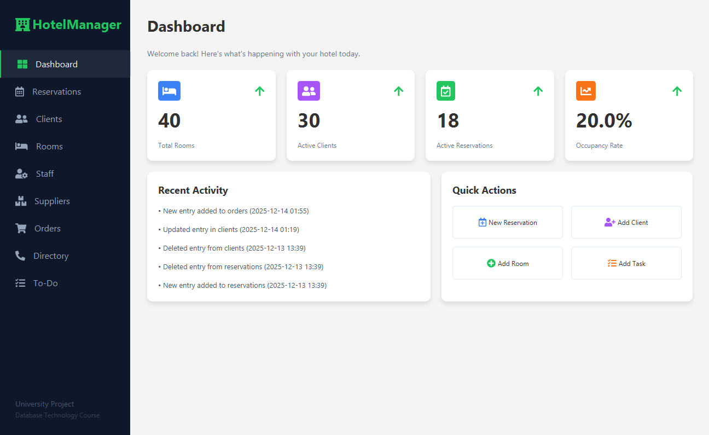

# HotelManager System

Μια ολοκληρωμένη Desktop εφαρμογή διαχείρισης ξενοδοχειακής μονάδας, ανεπτυγμένη με **JavaFX** και **PostgreSQL**.

Το έργο υλοποιήθηκε στα πλαίσια του μαθήματος **Τεχνολογία Βάσεων Δεδομένων** με στόχο την αντικατάσταση παραδοσιακών μεθόδων καταγραφής με μια σύγχρονη, κανονικοποιημένη βάση δεδομένων, προσφέροντας αυτοματισμούς, ασφάλεια συναλλαγών και ευχρηστία.




---

## Βασικές Λειτουργίες

### Dashboard & Analytics
* **Real-time Στατιστικά:** Προβολή πληρότητας, ενεργών κρατήσεων και συνολικών πελατών.
* **Activity Log:** Ζωντανή καταγραφή ενεργειών (Audit Trail) μέσω Database Triggers.
* **Quick Actions:** Άμεση πρόσβαση στις συχνότερες λειτουργίες.

### Διαχείριση Κρατήσεων (Smart Booking)
* **Δυναμική Διασύνδεση:** Επιλογή Πελάτη και Δωματίου από δυναμικές λίστες.
* **Αυτόματος Υπολογισμός:** Αυτόματη κοστολόγηση βάσει ημερών και τιμής δωματίου.
* **Status Lifecycle:** Υποστήριξη καταστάσεων (Active, Confirmed, Completed, Cancelled).

### Πελατολόγιο & JSON
* Πλήρης διαχείριση στοιχείων πελατών.
* **Ημιδομημένα Δεδομένα:** Υποστήριξη ειδικών προτιμήσεων (Preferences) σε μορφή **JSON** (PostgreSQL feature).

### Εργασίες & Προσωπικό
* **Task Management:** Λίστα To-Do με οπτική κωδικοποίηση για ολοκληρωμένες εργασίες.
* **Διαχείριση Προσωπικού:** Ανάθεση ρόλων και βαρδιών με color-coded roles.

---

## Τεχνολογίες & Αρχιτεκτονική

* **Γλώσσα:** Java (JDK 17+)
* **GUI Framework:** JavaFX (MVC Pattern)
* **Database:** PostgreSQL
* **Object–Relational mapping:** JDBC με DAO Pattern
* **Build Tool:** Maven

### Database Logic (Advanced Features)
Η εφαρμογή αξιοποιεί πλήρως τις δυνατότητες του Database Server:
1.  **Triggers:**
    * `log_activity`: Αυτόματη καταγραφή ιστορικού στο `app_logs` μετά από κάθε Insert/Update/Delete.
    * `set_order_number`: Αυτόματη παραγωγή μορφοποιημένου κωδικού παραγγελίας (π.χ. "ORD-000005").
2.  **Stored Procedures:**
    * `delete_client_procedure`: Ασφαλής διαγραφή πελάτη και των εξαρτώμενων κρατήσεών του (Transaction Safe).
3.  **JSON Types:** Αποθήκευση metadata πελατών.

---

## Εγκατάσταση & Εκτέλεση

### 1. Κλωνοποίηση (Clone)
```bash
git clone [https://github.com/KasoHodaj/Hotel-Managment-System.git](https://github.com/KasoHodaj/Hotel-Managment-System.git)
cd HotelManager-System
```

### 2. Ρύθμιση Βάσης Δεδομένων
1. Δημιουργήστε μια βάση δεδομένων στην PostgreSQL.
2. Εκτελέστε το script src/main/resources/schema.sql για να δημιουργηθούν οι πίνακες, οι Triggers και οι Procedures.

### 3. Ρύθμιση Σύνδεσης
1. Το αρχείο ρυθμίσεων της βάσης δεν συμπεριλαμβάνεται για λόγους ασφαλείας.
2. Πηγαίνετε στον φάκελο src/main/resources.
3. Βρείτε το αρχείο db.properties.example.
4. Μετονομάστε το σε db.properties.
5. Ανοίξτε το και συμπληρώστε τα δικά σας στοιχεία:
```bash
db.url=jdbc:postgresql://localhost:5432/to_username_sas
db.user=to_username_sas
db.password=o_kodikos_sas
```
### 4. Εκτέλεση
Ανοίξτε το project με IntelliJ IDEA και τρέξτε την κλάση HelloApplication.java.

## Δημιουργός
* ΚΑΣΟ ΧΟΝΤΑΙ
* Φοιτητής Τμήματος Μηχανικών Πληροφορικής.
* Μάθημα: Τεχνολογία Βάσεων Δεδομένων.
